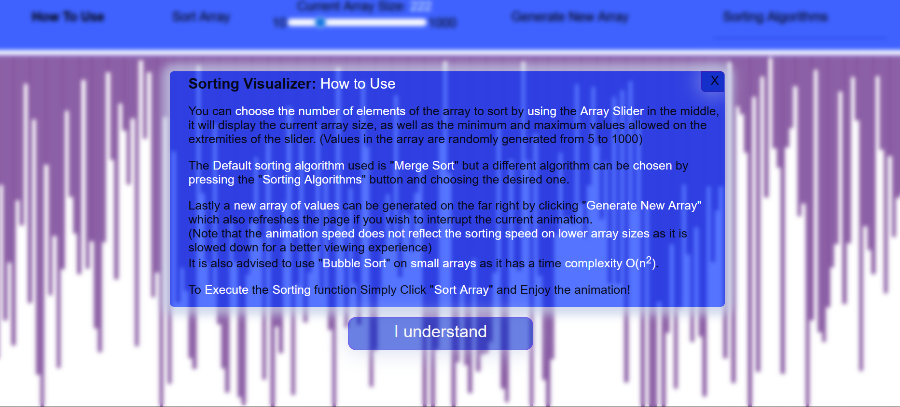
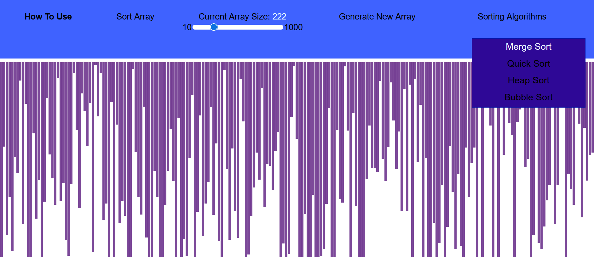
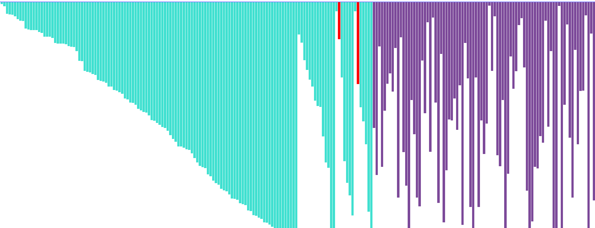

## Sorting Visualizer 📊https://mihay135.github.io/SortingVisualizer/

**Sorting Visualizer is a fun visualizer for a few of the most popular sorting algorithms using React app. It shows how the algorithms execute the sorting of the elements by animating the process. It features a slider to increment the array size of random numbers that represent the elements to be sorted as vertical bars, the algorithm choice and a reset button to interrupt the current execution and generate a new array. It also has a button to explain how the tool works**

## 📸 Screenshots
| **App View** |
|----------------|
| |
| **How To Use** |
|  | 
| **Choose the desired Algorithm (QuickSort by default)** |
| **Choose the array size with the slider** |
| **Press Sort Button to see the animation play!** |
|  |

## ✨ Features

- **Interactive Visualization**:
  - Arrays are represented as vertical bars, with heights reflecting values (5 to 1000).
  - Animations show the step-by-step process of sorting algorithms (slowed down for clarity).
- **Controls**:
  - **How to Use**: Opens a popup with instructions (blurs the background).
  - **Sort Array**: Triggers the sorting animation for the selected algorithm (MergeSort by default).
  - **Current Array Size**: Slider to adjust array size (10 to 1000 elements), updating the visualized array in real-time.
  - **Generate New Array**: Creates a new random array based on the slider size and resets any ongoing animation.
  - **Sorting Algorithms**: Dropdown to choose from MergeSort (default), QuickSort, HeapSort, or BubbleSort.
- **Algorithm Notes**:
  - BubbleSort is discouraged for large arrays due to its O(n²) complexity, which slows down the animation significantly.
  - Animations are deliberately slowed for educational purposes, not reflecting actual computation speed.
- **Simple Design**: Clean, user-friendly interface built with React for a smooth experience.

## 🛠️ Technologies Used

- **React.js**: Frontend framework for the single-page app.
- **JavaScript**: Core logic for sorting algorithms and animations.
- **HTML/CSS**: Styling for the minimalistic UI and bar visualizations.
- **Node.js/NPM**: For project setup and dependency management.

## 📋 Prerequisites

To run SortingVisualizer, ensure you have:
- Node.js (v16 or higher) and NPM installed.
- A modern web browser (e.g., Chrome, Firefox).
- Git (optional, for cloning the repository).

## 🚀 Getting Started
You can use the app by clicking the link at the beginning of the file or here https://mihay135.github.io/SortingVisualizer/.

Otherwise you can use your own computer following these steps:

### 1. Clone the Repository
```bash
git clone https://github.com/your-username/SortingVisualizer.git
cd SortingVisualizer
```

### 2. Install Dependencies

```bash
npm install
```
### 3. Run the Application
While in the project folder run this code:
```bash
npm start
```
### 4. Build for Production (optional)
```bash
npm build
```
This generates a production-ready build in the build/ folder.

### 🖼️How It Works
**1. Array Visualization**
  - The array is displayed as vertical bars, with heights representing values (5 to 1000).
  - Adjust the array size (10 to 1000) using the Current Array Size slider, which updates the bars in real-time.

**2. Sorting Animation**
  - Select an algorithm from the Sorting Algorithms dropdown (MergeSort, QuickSort, HeapSort, or BubbleSort).
  - Click Sort Array to start the animation, showing each step of the sorting process.
  - Note: BubbleSort is slow for large arrays due to O(n²) complexity.

**3. Array Generation**
  - Click Generate New Array to create a new random array based on the slider size.
  - This also resets any ongoing animation.

**4. Learn More**
  - Click How to Use to open a popup with instructions (blurs the background for focus).

**5.  Educational Focus**
  - Animations are slowed down to help users understand how each algorithm works, not to reflect actual computation speed.


### 📂Project Structure
```
SortingVisualizer/
|-- public/
│   |-- index.html            # Main HTML file
│   |-- favicon.ico           # App favicon
|-- src/
│   |-- App.js                # Main React component
│   |-- components/           # Sorting controls and visualization components
│   |-- algorithms/           # Sorting algorithm implementations
│   |-- styles/               # CSS for UI and animations
|-- build/                    # React Build
|-- node_modules/             # Node modules
|-- media/                    # Folder for screenshots
|-- package.json              # Project dependencies and scripts
|-- README.md                 # This file
```
## 🔧Usage Notes
**1. Array Size**
  - Use the slider to adjust the array size (10 to 1000). Smaller arrays are faster for animations, especially with BubbleSort.

**2. BubbleSort Warning**
  - Avoid using BubbleSort with large arrays (>200 elements) due to slow animation times.

**3. Animation Reset**
  - Clicking Generate New Array during an animation stops it and creates a new array.

**4. Learn More**
  - Click How to Use to open a popup with instructions (blurs the background for focus).

**5. Responsive Design**
 - The app is optimized for desktop but works on mobile browsers (slider and buttons may adjust).

### 🐞Troubleshooting

- **App Doesn’t Load**: Ensure Node.js is installed and run npm install again.
- **Animations Are Slow**: This is intentional for educational purposes. For BubbleSort, reduce the array size or reset the animation if it is playing.
- **Dependencies Issues**: Delete node_modules/ and package-lock.json, then run npm install.
- **Slider Not Updating**: Ensure your browser supports modern JavaScript (ES6+).

### 🌟Contributing
Contributions are welcome!🤝
- 1.Fork the repository.
- 2.Create a new branch (git checkout -b feature/your-feature).
- 3.Commit your changes (git commit -m "Add your feature").
- 4.Push to the branch (git push origin feature/your-feature).
- 5.Open a Pull Request.

Ideas for contributions:
- Add more sorting algorithms (e.g., Insertion Sort, Selection Sort).
- Improve animation smoothness or add speed controls.
- Enhance the UI with new themes or styles.

### 📜License
This project is licensed under the MIT License. See the LICENSE file for details.

### 👐Acknowledgments

- **<a href="https://reactjs.org/">React</a>** for the awesome frontend framework.
- Inspired by algorithm visualization tools like VisuAlgo.
- Thanks to the open-source community for endless inspiration!


